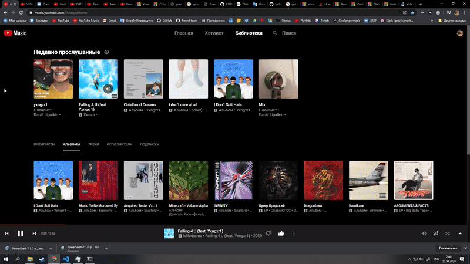

# Powershell Songs Download

This is simple powershell utility to easily grab and download songs and playlists
from popular websites.  
It automatically inserts metadata to files and embeds cool squared album arts (if `.png` or `.jpg/.jpeg` format is available 
and source file is one of the followings: `.mp3, .m4a, .m4b, .m4p, .m4v, .mp4,` this is true in most cases).



## Usage

### Syntax
`download-songs [-url] <String[]> [[-format] <String[]>] [-noPlaylist] [-saveThumbs] [-seeFormats] [<CommonParameters>]`

### Paramters description

**-url <String[]>** - the url to save songs from.

**-format <String[]>** - the requested format. Use -seeFormats paramater to check what formats are available.
Passed to youtube-dl, so check its -f parameter and [its doc](https://github.com/ytdl-org/youtube-dl/blob/master/README.md#format-selection).
  `"m4a/mp3/bestaudio"` by defalt.

**-noPlaylist** - whether to download only the song/video, if the URL refers to a song/video and a playlist. `$false` by default. See youtube-dl --no-playlist. param.

**--saveThumbs** - whether to erase the song thumb image files after the download process. `$false`  by default.

**--seeFormats** - if true, the the songs/videos won't be downloaded, but the command will output the available formats. `$false` by default.


### Examples

#### Download single song "Yxngxr1 - Falling 4 U" in default .m4a format from the YouTube Music playlist

```powershell
 download-songs -noPlaylist "https://music.youtube.com/watch?v=jCcGMtGRw5s&list=PLv5tSVP9eg2nkbqapepgxXYGCESsfLcu9"
```

#### Check all available formats for a single song "Psycho" from the YouTube Music album "Yxngxr1 - I Don't Suit Hats"

```powershell
download-songs -seeFormats -noPlaylist "https://www.youtube.com/watch?v=3ITW3pWaoWQ&list=OLAK5uy_mmO6QLOUTnk7GWFp_CVKH7B0gDgpGJI1A&index=2"
```

#### Download the whole playlist "Yxngxr1" from YouTube Music (despite the url points on a track) and save its thumbs
 
```powershell
 download-songs -saveThumbs "https://music.youtube.com/watch?v=jCcGMtGRw5s&list=PLv5tSVP9eg2nkbqapepgxXYGCESsfLcu9"
```

## Installation

Run the following command to install dependencies

```powershell
choco install youtube-dl ffmpeg imagemagick.app atomicparsley -y
```

Then install the powershell module itself

```powershell
Install-Module -Name Download-Songs
```

## Removal
Respectively

```powershell
choco install youtube-dl ffmpeg imagemagick.app atomicparsley -y
Remove-Module -Name Download-Songs
```

